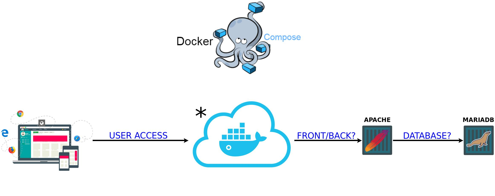

# Welcome to NRDR

The Non-coding RNA Databases Resource (NRDR) is a source of data related to over 100 non-coding RNA (ncRNA) databases available over the internet. Our ncRNA Databases Resource tries to represent an updated source for databases information retrieval. It is part of a review with the aim of surveying all ncRNA databases available.

## Infrastructure



# * 
This cloud represents the proxy environment and maintenance of SSL certificates that handles requests and forwards them to the project. This environment is present in the following repository: [Reverse Provy Apps](https://gitlab.com/integrativebioinformatics/reverse_proxy_apps) .

### Containers

- *Frontend* - Apache + PHP;
- *Database* - MariaDB.

2 Containers.

## Requisites

- Git version 2 or above
- Docker version 17.09.1-ce or above (https://docs.docker.com/install/)
- Docker Compose 1.20.1 or above (https://docs.docker.com/compose/install)

## Installation

Clone the repository with:
```
user@host:~# git clone https://gitlab.com/integrativebioinformatics/nrdr.git
```

## Pre-Execution

Create file `.env` in root directory on repository informing enviremont variables, content example:

```bash
user@host:~/nrdr# cat .env
DB_NAME=database_name
DB_USER=database_user
DB_PASS=database_password
```

Copy content frontend files PsalmonisDB for directory `volumes/frontend/`, thus:

```bash
user@host:~/nrdr# ls -l volumes/frontend/
total 56
drwxr-xr-x. 14 amandabackup 33  4096 Abr 18 00:17 application
drwxrwxr-x.  7 amandabackup 33  4096 Abr 17 20:47 assets
-rw-r--r--.  1 amandabackup 33   557 Abr 18 00:17 composer.json
-rw-r--r--.  1 amandabackup 33 10333 Abr 18 00:17 index.php
-rw-r--r--.  1 amandabackup 33 13319 Abr 18 00:17 license.txt
drwxr-xr-x.  2 amandabackup 33  4096 Abr 25 12:36 sessions
drwxr-xr-x.  8 amandabackup 33  4096 Abr 18 00:17 system
drwxr-xr-x.  3 amandabackup 33  4096 Abr 18 00:17 webservices
```

Define permissions for user `www-data` in directory back/front which will be mounted as volume in container. Because the user may not exist on the host host, we use the gid that is standard on any system. Execute:

```bash
user@host:~/nrdr# chown 33:33 -R volumes/frontend
```

**Database files?**

Just add their sql files in the `build/db/dump/` directory in deploy case, they will be executed in the container in alphabetical order. So if you have a `schema.sql` and `data.sql` file, is important renaming them to `1-schema.sql` and `2-data.sql`. 

If you want, you can compress them (to reduce space) in a format accepted by the docker (gzip, bzip2 our xz) and the container will do the extraction.

**OBS.:** The content on `/var/lib/mysql` in "real time" container, will be in `volumes/db` .

## Execution

In the root repository, execute the next command:

```bash
user@host:~/nrdr# docker-compose up --build -d
```
The option `-d` execute containers in background.

Is possible check process with:

```bash
user@host:~/nrdr# docker-compose logs -f
```

The option `-f` stay logs in screen, to cancel execute Ctrl + C.

**OBS.:** For scalability reasons, this project was designed to receive requests from a proxy, so port 80 is not exposed. If you need to run the environment locally (exposed port 80), the command is as follows:

```bash
user@host:~/nrdr# docker-compose -f docker-compose-local.yml up -d
```
